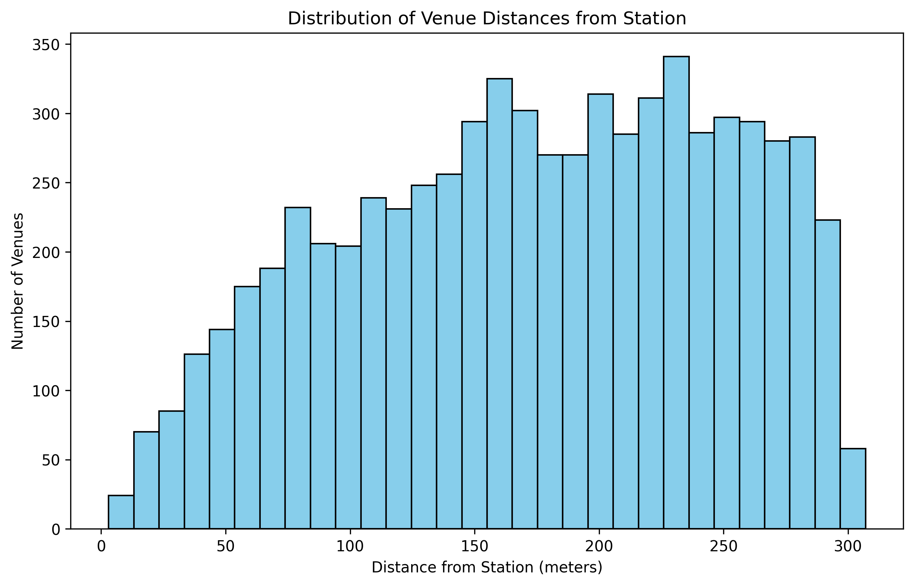
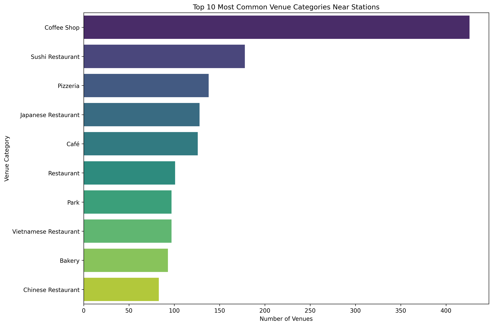
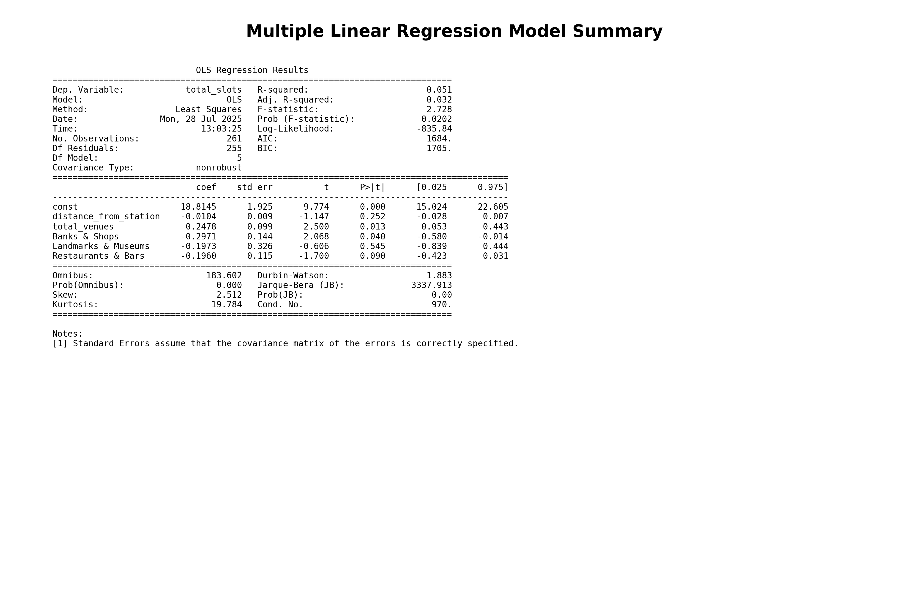

# Final-Project-Statistical-Modelling-with-Python

## Project/Goals

In this project, I examine the locations and capacities of the Mobi bikeshare system in Vancouver, BC. I looked for venues around each bike station using data from Foursquare, and analyzed the data. My goal is to determine if there is a relation between the average distance of venues from each station and the bike capacity of that station, and if there is a relationship between types of POIs around each station and the bike capacity of that station. I attempt to build a statistical model of the relationship.

## Process

I begin with pulling data about each bike station from the City Bike API. Specifically, I take the station location, name and total number of bike slots.

Querying by general category IDs led to redundancy in the dataset due to venues being multi-tagged across various classifications, resulting in duplicate records. To streamline the analysis, I extracted all POIs initially and performed post-processing to classify them into broader categories, focusing specifically on restaurants and bars, landmarks, banks, and retail establishments.

For each bike station, I analyzed the number of venues around, and also the distance of the venue from the station. I then generated some graphs to visualize this data. Finally, I generated regression models using average distance of venues from each station and number of venues as predictors, to see if these data have relationship with bike station capacities.

## Results

The histogram shows a relatively uniform distribution of venues across the 0-300 meter range from bike stations, with the highest concentration occurring at approximately 150-160 meters (340+ venues). 

Coffee shops overwhelmingly dominate with 426 venues, and most of the top 10 categories are restaurants, cafes and bakeries. This indicates that Vancouver's bike-share system is closely intertwined with its rich food culture, with coffee shops and Asian restaurants dominating the landscape of nearby venues.

The initial multiple regression model shows that venue categories have varying relationships with station capacity, but many predictors are not statistically significant (p > 0.05). The model's overall explanatory power remains modest, suggesting that venue density alone doesn't fully explain station sizing decisions in Vancouver's bike-share system.

The backward elimination process removed all venue category variables, leaving only `total_venues` as the single significant predictor (p = 0.007). The final model shows that for each additional venue near a station, the number of bike slots increases by approximately 0.06 slots. However, the model explains only 2.8% of the variance in station capacity (R-squared = 0.028), indicating that total venue count has a statistically significant but practically weak relationship with station sizing. 
The low explanatory power suggests that Vancouver's bike station capacity decisions are primarily driven by factors other than local venue density, such as ridership patterns, network connectivity, or strategic placement considerations.

## Challenges

One challenge I encountered was the result limit and request limits for Foursquare, I need to limit my requests to maximum 50 per station, reduce radius to 300m due to the limitation.

Another challenge is querying by general category IDs led to redundancy in the dataset due to venues being multi-tagged across various classifications, resulting in duplicate records. I need to extract all POIs and then group them into broader categories, but this may lead to missing data, which would create biases.

## Future Goals

To take this project further, I need to explore larger data size using a wider radius and no limit on the number of venues retrieved and categories should be broken down to give further detail. Another factor that could be considered could be a bike station's proximity to other bike stations, are there overlaps for the venues data across stations.

